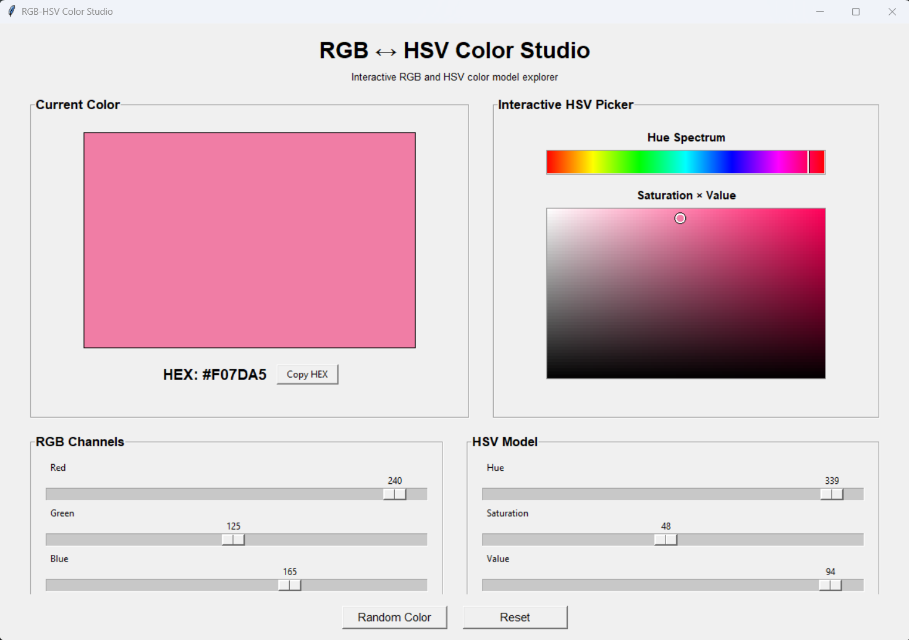
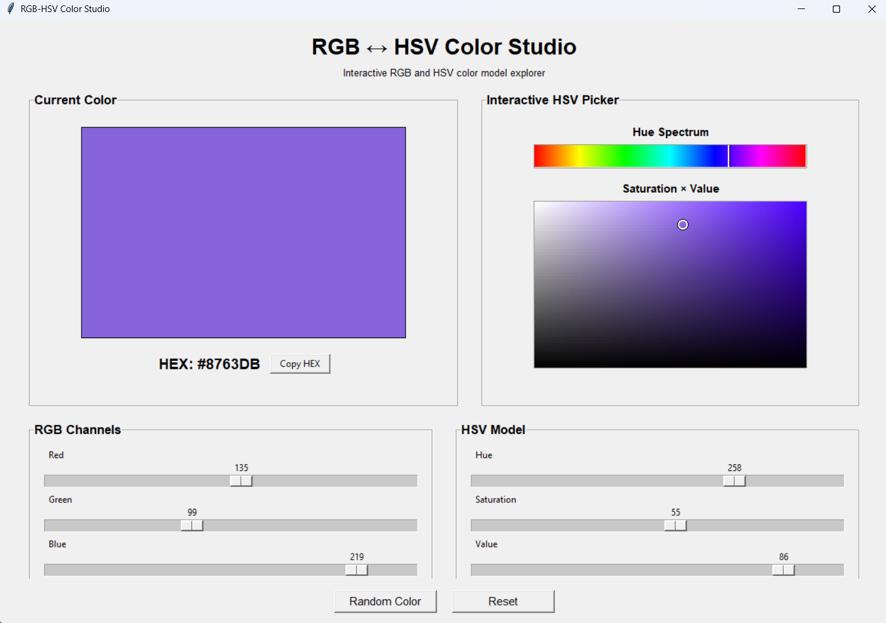
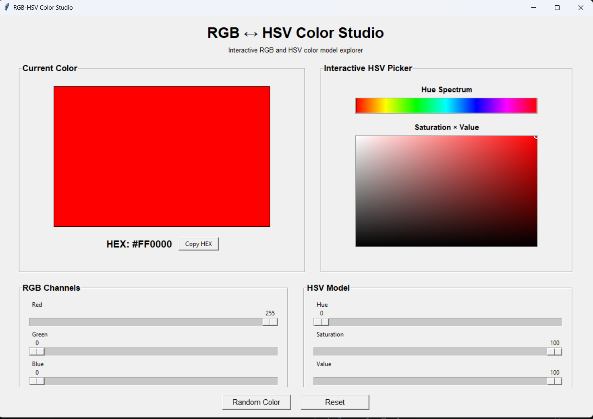

# RGB ↔ HSV Color Studio

An interactive desktop application for exploring RGB and HSV color models and their bidirectional conversion.

The project was developed as part of a Computer Graphics course assignment. It provides both numerical controls and visual color-picking tools, allowing users to observe how RGB and HSV representations correspond in real time.

## Features

- Interactive RGB color selection
- Interactive HSV color selection
- Real-time RGB → HSV conversion
- Real-time HSV → RGB conversion
- Live color preview
- Interactive Hue spectrum
- Saturation × Value 2D color picker
- HEX color display
- Copy HEX value to clipboard
- Random color generation
- Reset function
- Standalone Windows executable

## Screenshots

### Main Interface



The main interface combines a live color preview, RGB controls, HSV controls, and an interactive HSV color picker.

### Interactive HSV Picker



Hue can be selected from the Hue spectrum, while Saturation and Value can be selected interactively from the two-dimensional color field.

### RGB → HSV Conversion



Example:

```text
RGB: (255, 0, 0)
HSV: (0°, 100%, 100%)
HEX: #FF0000
```

## How It Works

The application supports two-way synchronization:

```text
RGB Controls
     ↓
RGB → HSV
     ↓
HSV Controls
     ↓
Color Preview
```

and:

```text
HSV Controls / HSV Picker
     ↓
HSV → RGB
     ↓
RGB Controls
     ↓
Color Preview
```

Changing either color model immediately updates the other representation and the displayed color.

## RGB → HSV

RGB values are first normalized from the range `0–255` to `0–1`.

The conversion then uses the maximum and minimum RGB components:

```text
Cmax = max(R, G, B)
Cmin = min(R, G, B)
Δ = Cmax - Cmin
```

Value is determined by `Cmax`, Saturation is calculated from the difference between the maximum and minimum components, and Hue is calculated according to which RGB component is the maximum.

## HSV → RGB

HSV conversion uses Hue to determine the color sector and uses Saturation and Value to calculate the RGB channel intensities.

The intermediate values are:

```text
C = V × S
X = C × (1 - |(H / 60 mod 2) - 1|)
m = V - C
```

The final RGB values are then converted back to the `0–255` range.

## Tech Stack

- **Language:** Python
- **GUI:** Tkinter
- **Development Environment:** Visual Studio Code
- **Version Control:** Git & GitHub
- **Packaging:** PyInstaller
- **Platform:** Windows

The RGB ↔ HSV conversion algorithms are implemented directly in the project rather than relying on a color-conversion library.

## Project Structure

```text
rgb-hsv-color-studio/
│
├── src/
│   ├── main.py
│   └── color_converter.py
│
├── screenshots/
│   ├── main-interface.png
│   ├── hsv-picker.png
│   └── rgb-to-hsv.png
│
├── docs/
│   └── assignment.md
│
├── README.md
├── PROJECT_CONTEXT.md
└── .gitignore
```

## Run from Source

### Requirements

- Python 3
- Tkinter

Clone the repository:

```bash
git clone https://github.com/normal767/rgb-hsv-color-studio.git
cd rgb-hsv-color-studio
```

Run the application:

```bash
python src/main.py
```

## Windows Executable

A standalone Windows executable can be generated with PyInstaller:

```bash
pyinstaller --onefile --windowed --name RGB-HSV-Color-Studio src/main.py
```

The generated executable is located in:

```text
dist/RGB-HSV-Color-Studio.exe
```

It can be launched directly without opening the source code or Visual Studio Code.

## Learning Objectives

This project demonstrates:

- RGB color representation
- HSV color representation
- Color-space conversion
- Interactive computer graphics interfaces
- Event-driven GUI programming
- Mapping mouse coordinates to color parameters
- Real-time synchronization between different color representations

## Future Work

Possible future improvements include:

- Additional color models such as HSL or CMYK
- Color history and palette saving
- More advanced visualization of color spaces
- Additional export options